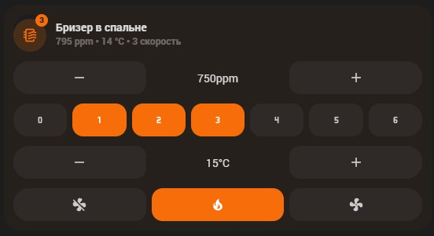

# Набор Tion Breezer для Home Assistant

Репозиторий помогает быстро собрать единый интерфейс управления бризером Tion в Home Assistant: готовые пакеты ESPHome, карточка UI Lovelace Minimalist, попап и переводы.

## Что внутри
- `esphome/` — пакеты для ESPHome с авто-режимом по CO₂, вспомогательными сервисами и диагностикой.
- `ui_lovelace_minimalist/custom_cards/` — карточка `custom_card_dko_tion_breezer` и попап для UI Lovelace Minimalist.

## Требования
- Home Assistant — сама платформа, которая управляет устройством.
- Компонент ESPHome для управления бризерами Tion (проверено с [dentra/esphome-tion](https://github.com/dentra/esphome-tion)) — прошивка и автоматизация контроллера.
- UI Lovelace Minimalist (см. [инструкцию по установке](https://ui-lovelace-minimalist.github.io/UI/setup/installation/)) — шаблоны и движок для карточки.
- Дополнительные интеграции `custom:button-card` (рендер карточки), `browser_mod` (попапы), `custom:apexcharts-card` (график CO₂ в попапе).

## Установка и настройка
1. **Получите файлы.** Клонируйте репозиторий или скачайте архив с GitHub.
2. **Подключите пакеты ESPHome.** В конфигурации вашего устройства добавьте нужные пакеты и укажите датчик CO₂ из Home Assistant:
   ```yaml
    # пример секции packages в конфигурации ESPHome
    substitutions:
      # Добавьте данную подстановку с указанием имени сенсора CO2 в раздел substitutions
      auto_mode_co2_sensor: sensor.living_room_co2

    packages:
      # Добавьте данный пакет в раздел packages
      tion_auto_mode:
        url: https://github.com/dima11235/esphome-tion-ha-lovelace
        ref: main
        refresh: 0s
        files:
          - esphome/tion_auto_mode.yaml
          - esphome/tion_set_fan_speed.yaml
          - esphome/tion_others.yaml

    climate:
      - platform: tion
        id: tion_climate
        name: None # задайте здесь значение None, чтобы работали автоподстановки в каточке
        enable_heat_cool: True
        enable_fan_auto: False
   ```
3. **Скопируйте карточку.** Перенесите каталог `ui_lovelace_minimalist/custom_cards/custom_card_dko_tion_breezer/` в `<config>/ui_lovelace_minimalist/custom_cards/`. Создайте папку `custom_cards`, если её нет. Перезапустите UI Lovelace Minimalist или Home Assistant, если шаблон не появился сразу.
4. **Добавьте карточку в дашборд.** После перезапуска UI Lovelace Minimalist или Home Assistant добавьте карточку на страницу:
   ```yaml
   # пример добавления карточки в Lovelace
   - type: "custom:button-card"
     template: "card_dko_tion_breezer"
     entity: climate.tion_breezer
     variables:
       ulm_card_breezer_enable_controls: true
       ulm_card_breezer_enable_popup: true  # требуется browser_mod
   ```
   Карточка автоматически подставляет идентификаторы вспомогательных сущностей, используя префикс из имени `climate`. Если у вас другое именование в ESPHome, задайте переменные явно (см. начало `custom_card_dko_tion_breezer.yaml`).
5. **(Опционально) Подключите попап.** Держите рядом файл `custom_card_dko_popup_tion_breezer.yaml` и оставьте переменную `ulm_card_breezer_enable_popup: true`. Попап показывает питание, нагрев, целевой CO₂, границы скорости и график за 24 часа (нужен `custom:apexcharts-card`).

## Сущности и сервисы, которые использует карточка
Карточка подставляет названия по шаблону `climate.<имя>` → `<имя>_…`. Убедитесь, что в системе доступны:
- `switch.<имя>_power_mode`, `_heater_mode`, `_silent_mode`, `_recirculation` — питание, нагрев, тихий режим, рециркуляция.
- `select.<имя>_air_intake` — если компонент ESPHome создаёт выбор притока/рециркуляции; при отсутствии карточка обращается к `switch.<имя>_recirculation`.
- `number.<имя>_target_co2`, `_min_fan_speed`, `_max_fan_speed`, `_heater_temperature` — целевой CO₂, границы и температура нагревателя.
- `sensor.<имя>_current_co2`, `_fan_speed`, `_outdoor_temperature` — текущие показания датчиков.
- Сервис `esphome.<имя>_set_fan_speed` — для ручного задания скорости (кнопки 0–6).

Если имена отличаются, переопределите переменные в конфигурации карточки.

## Предпросмотр



## Локализация
Готовые строки лежат в `languages/` (русский и английский). Чтобы добавить язык, создайте файл `<lang>.yaml` по аналогии с существующими.

## Лицензия
MIT, текст — в [`LICENSE`](LICENSE).


