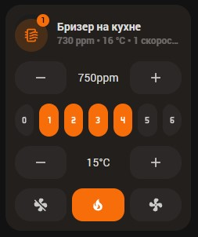

# Набор Tion Breezer для Home Assistant

Репозиторий даёт готовые ESPHome-пакеты и карточку UI Lovelace Minimalist (ULM) для управления бризером Tion в Home Assistant.

## Что внутри
- `esphome/` — набор конфигураций ESPHome.
- `ui_lovelace_minimalist/custom_cards/` — карточка `custom_card_dko_tion_breezer` и попап для ULM.

## Требования
- Home Assistant.
- Компонент ESPHome для бризеров Tion - см. [dentra/esphome-tion](https://github.com/dentra/esphome-tion).
- UI Lovelace Minimalist — см. [инструкцию по установке](https://ui-lovelace-minimalist.github.io/UI/setup/installation/).
- Карточки `custom:button-card`, `browser_mod`, `custom:apexcharts-card`.

## Установка и настройка
1. **Получите файлы.** Клонируйте репозиторий или скачайте архив с GitHub.
2. **Подключите пакеты ESPHome.** В конфигурации устройства добавьте сенсор CO₂ и подключите пакеты (пример ниже):
   ```yaml
    substitutions:
      auto_mode_co2_sensor: sensor.living_room_co2

    packages:
      tion_auto_mode:
        url: https://github.com/dima11235/esphome-tion-ha-lovelace
        ref: main
        refresh: 0s
        files:
          - esphome/tion_auto_mode.yaml
          - esphome/tion_set_fan_speed.yaml
          - esphome/tion_others.yaml

   climate:
      - platform: tion
        id: tion_climate
        name: None
        enable_heat_cool: True
        enable_fan_auto: False
   ```
   Карточка может быть совместима со стандартными сущностями `esphome-tion` (`climate`, `switch`, `number`, `sensor` и т.д.), однако такой вариант пока не тестировался. Единственное дополнение — сервис `esphome.<имя>_set_fan_speed` для задания диапазона скоростей. Его добавляет минимальный пакет `esphome/tion_set_fan_speed.yaml`, подключённый в раздел `packages`.

   **Минимальный пример конфигурации.** Если используются сущности автоматического управлению скоростью из пакета [dentra/esphome-tion](https://github.com/dentra/esphome-tion):
   ```yaml
    packages:
      tion_auto_mode:
        url: https://github.com/dima11235/esphome-tion-ha-lovelace
        ref: main
        refresh: 0s
        files:
          - esphome/tion_set_fan_speed.yaml
   ```
   Такой конфигурации может быть достаточно (не тестировалось), чтобы карточка работала, а сервис `esphome.<имя>_set_fan_speed` позволял задавать диапазон скоростей из интерфейса.
3. **Скопируйте карточку.** Перенесите каталог `ui_lovelace_minimalist/custom_cards/custom_card_dko_tion_breezer/` в `<config>/ui_lovelace_minimalist/custom_cards/`. Создайте папку `custom_cards`, если её нет. Перезапустите UI Lovelace Minimalist или Home Assistant, если шаблон не появился сразу.
4. **Добавьте карточку в дашборд.** После перезапуска UI Lovelace Minimalist или Home Assistant добавьте карточку на страницу:
   ```yaml
   - type: "custom:button-card"
     template: "card_dko_tion_breezer"
     entity: climate.tion_breezer
     variables:
       ulm_card_breezer_enable_controls: true
       ulm_card_breezer_enable_popup: true  # требуется browser_mod
   ```
   Карточка автоматически подставляет идентификаторы вспомогательных сущностей, используя префикс из имени `climate.` устройства. Если у вас другое именование в ESPHome, задайте переменные явно (см. начало `custom_card_dko_tion_breezer.yaml`).
5. **(Опционально) Подключите попап.** Держите рядом файл `custom_card_dko_popup_tion_breezer.yaml` и оставьте переменную `ulm_card_breezer_enable_popup: true`. Попап показывает питание, нагрев, целевой CO₂, границы скорости и график за 24 часа (нужен `custom:apexcharts-card`).

## Сущности и сервисы, которые использует карточка
Карточка ищет сущности по шаблону `climate.<имя>`. Нужны:
- `switch.<имя>_power_mode`, `_heater_mode`, `_silent_mode`, `_recirculation`.
- `select.<имя>_air_intake` (если компонент его создаёт; иначе используется `switch.<имя>_recirculation`).
- `number.<имя>_target_co2`, `_min_fan_speed`, `_max_fan_speed`, `_heater_temperature`.
- `sensor.<имя>_current_co2`, `_fan_speed`, `_outdoor_temperature`.
- Сервис `esphome.<имя>_set_fan_speed`.

При другом именовании переопределите переменные в конфигурации карточки.

## Предпросмотр



## Локализация
Готовые строки лежат в `languages/` (русский и английский). Чтобы добавить язык, создайте файл `<lang>.yaml` по аналогии с существующими.

## Лицензия
MIT, текст — в [`LICENSE`](LICENSE).
